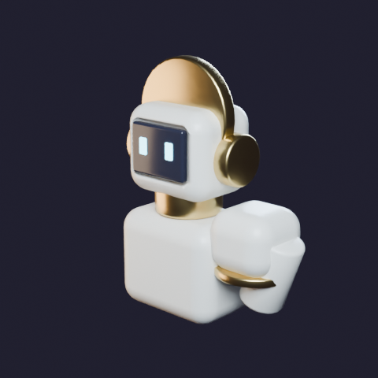
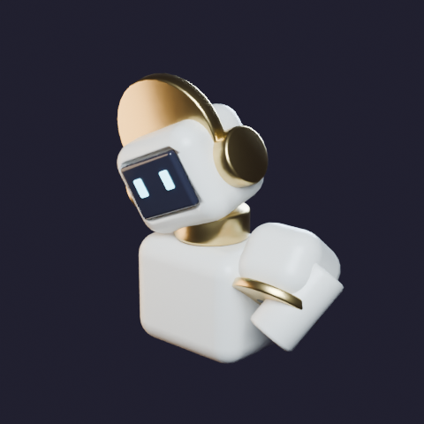
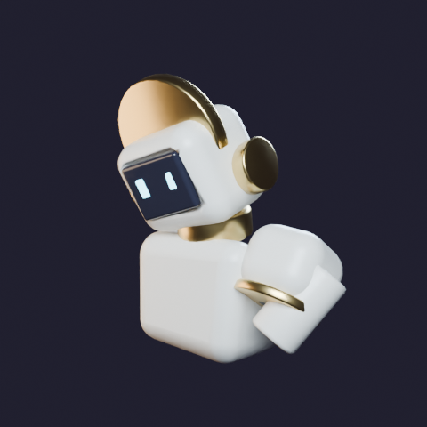
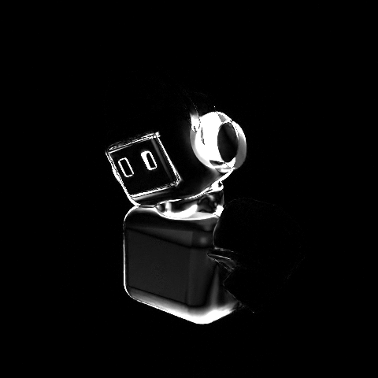
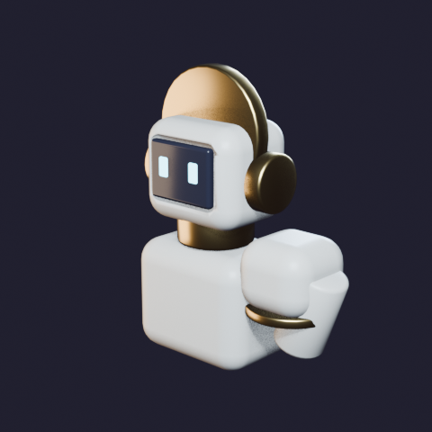
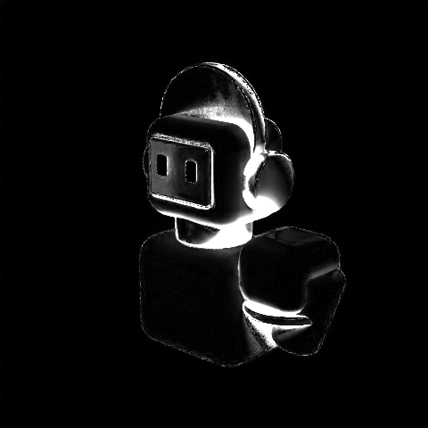
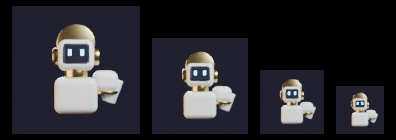

# Blender feasibility spike

Bounded feasibility spike. Fabricator session, branch `claude/virgil-blender-feasibility`, base `dd8ddb1`.

**This is a spike, not a build.** It produced no production asset, no application
code and no character. Nothing in it is a Phase 1 deliverable, nothing in it is
approved, and nothing in it may be moved into `assets/`. The test object is a
deliberately generic robot part; no attempt was made to model Virgil. Under
`CLAUDE.md` this report is a builder's claim, not evidence: the numbers below
are reproducible by the scripts in `spikes/blender-feasibility/`, and a
reviewer should re-run them rather than take this document's word.

---

## Answer for the owner

**Yes, this route works, and it is fast.** Blender installs inside a container as
a Python module in about 20 seconds and roughly 1 GB of disk, with no graphics
card and nothing bought. A session can build a chunky robot part out of separate
rigid shells, put bones in it, animate a short loop, render it on the processor
in under three seconds, export it, and confirm it loads in the application's own
3D stack — the whole chain, end to end, takes **5.1 seconds**. That means a
session can genuinely work here: change the model, look at it, decide it is
wrong, fix it, look again, several times a minute. What a session *cannot* judge
in here is how the character will finally look — colour, glow and the polish of
motion still need your machine. But it can judge the things that actually decide
whether a robot is well built: its outline, its proportions, whether the parts
read as separate, whether a joint is properly hidden, and whether the screen face
is still readable when the character is small on screen. **On the evidence below,
a model-generation subscription is not required to find out whether this
character family can be built.** It may still be worth buying for speed or for
your own reasons; this spike does not measure that, and it says nothing at all
about whether what a session builds would be charming.

---

## Environment

Four CPU cores, 15 GB RAM, no GPU. Python 3.11.15. Node 22.22.2, pnpm 10.33.0.

Baseline re-verified at the start of this session rather than assumed:

| Check | Result |
|---|---|
| `which blender` | absent |
| `python3 -c "import bpy"` | `ModuleNotFoundError: No module named 'bpy'` |
| `https://pypi.org/simple/bpy/` | 200 |
| `https://huggingface.co/` | no response — proxy `connect_rejected` |
| `https://api.meshy.ai/` | no response — proxy `connect_rejected` |
| `https://api.tripo3d.ai/` | no response — proxy `connect_rejected` |
| `https://www.blender.org/about/license/` | no response — proxy `connect_rejected` |

Package registries are open; arbitrary hosts are not. No attempt was made to
reach a paid generation service or to work around the network policy. The
unreachable hosts above were probed once each to confirm the stated baseline,
and blender.org was probed to try to read a licence; see the licence section for
what that cost in certainty.

---

## 1. Can Blender run here at all? — Yes

```
pip install --no-cache-dir --timeout 180 --retries 8 bpy
```

| Measurement | Value |
|---|---|
| Version | **bpy 5.0.1**, wheel `bpy-5.0.1-cp311-cp311-manylinux_2_28_x86_64.whl` |
| Download | 374.3 MB at ~92 MB/s |
| Install wall-clock | **22 s** |
| Disk, empty venv | 24,075,347 B |
| Disk, after install | 994,192,268 B (**+925 MiB**) |
| Of which `site-packages/bpy` | 848,541,353 B (809 MiB) |
| Root filesystem available, before → after | 32,130,703,360 → 31,110,017,024 B (−973 MiB) |
| `import bpy` + add a cube + report | **593 ms** |
| `bpy.app.background` | `True` |
| `bpy.app.binary_path` | `''` (no executable; it is a library, not a GUI) |
| Render engines offered | `CYCLES`, `BLENDER_EEVEE`, `BLENDER_WORKBENCH` |

Two things a later session should know:

- **The first install attempt failed.** With pip's default 15-second socket
  timeout, the 374 MB wheel died at 16 s with
  `urllib3.exceptions.ReadTimeoutError` against `files.pythonhosted.org`.
  `--timeout 180 --retries 8` fixed it. A session that reads a bare pip failure
  as "Blender cannot be installed here" would report the wrong answer.
- **bpy 5.0.1 declares `Requires-Python: ==3.11.*`.** The container is on
  3.11.15 today. If the image moves to 3.12 or later, `pip install bpy` will
  find no wheel and this whole route stops working until a matching build
  exists. That is a real, dated dependency on the container image.

## 2. Can it build geometry programmatically? — Yes

`scripts/build_part.py` builds a generic robot part in the idiom of
`docs/art-direction/ART_BIBLE.md` §8 and the approved sheet
`assets/concepts/characters/virgil-turnaround.png`: cream ceramic shells,
brass trim, a dark recessed screen face with emissive cyan glyph eyes, and a
shoulder built as a dark ball joint under an overlapping pauldron shell. Every
part is a separate rigid object — a heavily bevelled box or cylinder, shaded
smooth — never one bent solid.

| Measurement | Value |
|---|---|
| Parts | 13 separate mesh objects |
| Vertices / faces (evaluated) | 2,926 / 2,740 |
| Build time | **0.19 s** |



**Finding: a live boolean modifier is not rigid.** The screen recess was first
cut with a boolean modifier left un-applied. Under a posed armature the cutter no
longer travels with the head shell, the recess shears, and the head measured
0.693 m of deformation — 3.2 million times the rigid baseline. Applying the
boolean at build time and deleting the cutter reduced it to the float-noise
floor. Any pipeline that keeps live booleans on an animated rigid shell will
produce a character that comes apart in motion.

## 3. Can it rig and animate? — Yes, and rigid-shell parts are the reason it works

`scripts/rig_animate.py` builds a five-bone armature (spine, neck, head,
shoulder, arm) and rigs the same 13 parts two ways, then poses both identically
(head tilted 14°/22°, shoulder swung 38°).

The metric is deliberately not a visual impression. For each part, a fixed
sample of 400 vertex pairs is measured in the rest pose and in the posed frame.
A rigid body preserves *every* pairwise distance exactly; any non-zero maximum
deviation is the shell bending.

**A — bone parenting** (each shell is a child of one bone):

| Part | Max pairwise-distance deviation |
|---|---|
| all 13 parts | ≤ **2.113e-07 m** (0.2 µm on a 1.5 m figure) |

**B — armature deform with automatic weights** (the usual approach for an
organic character):

| Part | Max pairwise-distance deviation |
|---|---|
| torso_shell | **1.092e-01 m** |
| ear_pod_1 | 5.340e-02 m |
| neck_collar | 2.090e-02 m |
| head_shell | 1.796e-02 m |
| screen_panel | **1.482e-02 m** |
| glyph_eye_1 | 2.239e-03 m |
| pauldron_shell, shoulder_ball, upper_arm, pauldron_trim, brow_band | ≤ 3.9e-07 m |

**Automatic weights bend the shells by a factor of ~5×10⁵ over bone parenting.**
The torso warps by 109 mm. The flat screen face — the part that has to stay flat
for the character to have a face — warps by 15 mm. Parts far from a joint happen
to survive; parts near one do not, and which ones are affected is an accident of
the weight solver, not a design choice.

So the answer to the question as posed: **yes, rigid-shell parts avoid the
deformation that automatic rigging causes, and they avoid it exactly, not
approximately.** This is not a stylistic preference. For a character made of
hard ceramic panels, bone parenting is the correct construction and automatic
weights are simply wrong. The approved art direction and the technically robust
approach agree here, which is a useful thing to know before committing to a
character pipeline.

| Measurement | Value |
|---|---|
| Rig time, A / B | 0.03 s / 0.05 s |
| Loop closure, frame 1 vs frame 49 | **0.000e+00 m** (exact) |
| Clip | 48 frames, Bézier ease-in-out on head and shoulder |

Rendered, the two rigs differ visibly but not dramatically: 4.116% of pixels
differ by more than 8/255 at 480 px, concentrated on the silhouette edges and
the screen-face frame.

| Bone-parented (rigid) | Automatic weights | Difference, amplified 8× |
|---|---|---|
|  |  |  |

That comparison is itself a finding for question 6: **the 109 mm torso
deformation is hard to see at preview size and easy to measure.** A session that
judges rigging by eye will pass a broken rig; a session that runs the metric will
not.

**Two API traps in Blender 5.0**, both of which cost cycles here:

- `Action.fcurves` no longer exists (slotted actions). Scripts written against
  Blender 4.x raise `AttributeError`. Setting
  `preferences.edit.keyframe_new_interpolation_type` before inserting keyframes
  is the working substitute.
- Object-to-bone parenting is relative to the bone **tail**, so deriving
  `matrix_parent_inverse` from the bone matrix scatters the parts. The reliable
  recipe is to save `matrix_world`, set the parent, force a view-layer update,
  then restore `matrix_world`. The rigidity numbers were unaffected by this bug —
  each part stayed rigid, just in the wrong place — but the first pose render was
  visibly wrong, which is how it was caught.

## 4. Can it render, and how slowly? — Yes, on Cycles CPU, and it is fast enough

Cycles, CPU device, 4 threads, denoising on, adaptive sampling on. Single still,
the 13-part object:

| Resolution | Samples | Wall-clock |
|---|---|---|
| 320 × 320 | 16 | **0.92 s** |
| 480 × 480 | 32 | **2.60 s** |
| 960 × 960 | 64 | 16.56 s |
| 1080 × 1080 | 128 | 33.48 s |
| 1920 × 1920 | 256 | **191.48 s** (3 min 11 s) |

48-frame loop:

| Resolution | Samples | Per frame | Full 48-frame loop |
|---|---|---|---|
| 320 × 320 | 24 | 1.03 s | **~50 s** |
| 480 × 480 | 32 | 2.54 s | **~122 s** |

**Finding: EEVEE and Workbench do not work out of the box, and they fail
silently.** Both printed one line to stderr —
`Couldn't open libEGL.so.1: cannot open shared object file` — raised **no Python
exception**, and wrote **no image file**. `bpy.ops.render.render(write_still=True)`
returned normally. A session that does not check for the output file will report
a successful render that never happened. Cycles is unaffected because it does not
need a GL context.

The gap is closable: `apt-get install libegl1 libgl1-mesa-dri libglapi-mesa`
(43 MiB, from the Ubuntu archive, which the proxy allows) makes EEVEE run on
Mesa's llvmpipe software rasteriser. **It is not worth doing.** EEVEE then took
**32.37 s** at 480×480/32 against Cycles' 2.60 s — 12.4× slower. The intuition
that the raster engine is the fast preview and the path tracer is the slow final
render is inverted here: llvmpipe is a software GL implementation, while Cycles'
CPU backend is heavily optimised for exactly this case. **On this container,
Cycles CPU is the fast path and there is no faster one.**

## 5. Can it export something the application can load? — Yes

Exported with the bundled `io_scene_gltf2`, modifiers applied, animation and
frame range included, Y-up.

| Measurement | Value |
|---|---|
| File | `spike_part.glb`, glTF-Binary, **159,212 bytes** |
| Export time | 0.09 s |

Loaded headlessly through this project's own rendering stack (ADR-0003) —
`three` 0.185.1 from `apps/mission-control/node_modules`, `GLTFLoader.parse`, no
WebGL context created:

| Measurement | Value |
|---|---|
| `THREE.REVISION` | 185 |
| Parse time | **10.0 ms** |
| Meshes / materials / triangles | 13 / 5 / 5,800 |
| Bones | 5 |
| Animation clips | 1 — `spike_idle_loop`, 2.000 s, 15 tracks |
| Bounding box | 1.209 × 1.510 × 0.542 m |
| `AnimationMixer` drives it | `head_shell` moves **0.1159 m** between t=0 and t=1.0 s |

The bone-parented rigid shells survive the glTF round trip as a node hierarchy
under the joints, and three's own animation system plays the clip. This is a
headless parse-and-evaluate test, as scoped; it does not establish that the model
*renders* correctly in the app, only that it loads and animates.

## 6. What can a software render honestly judge?

`docs/process/PHASE_0_RUN_RECORD.md` records that "software-rendered captures may
overstate or understate bloom and colour". That claim is about *appearance*. This
spike tested it against **form**, and form behaves differently.

### Silhouette — renderer-independent, measured

The same scene was rendered on two fundamentally different renderers — Cycles
(path tracer, CPU) and EEVEE (rasteriser, on llvmpipe) — with a transparent film,
and the **alpha channel** compared. Alpha is exact per-pixel coverage, not a
guess from brightness.

| Measurement | Value |
|---|---|
| Coverage IoU at α > 0.5 | **0.999738** |
| Disagreeing pixels | **14** of 230,400 (0.0061% of frame) |
| Antialiased edge pixels in the frame | 2,167 |
| Mean \|alpha difference\| overall / on edges | 0.000132 / 0.012916 |
| Max \|alpha difference\| | 0.0706 |

The two renderers disagree about the silhouette by fourteen pixels, all of them
on antialiased edges. **Silhouette, proportion and part separation are decided by
geometry and camera, not by the renderer.**

The same two renders disagree about *shading* on **5.117%** of pixels by more
than 8/255 (mean absolute difference 0.00985, max 0.784) — the brass reads
differently, the contact shadows differ, the ambient occlusion differs.

| Cycles | EEVEE (llvmpipe) | Difference, amplified 8× |
|---|---|---|
|  |  |  |

That is the split, in one experiment: **the outline is the same to within
0.006% of the frame; the surface is different on 5% of it.**

### Joint occlusion — measurable exactly, with a control

Is the ball joint really hidden under the overlapping pauldron shell? The ball
was given a unique flat emission colour and the scene rendered from a 24-angle
turntable; any pixel of that colour is exposed ball. No colour or lighting
judgement is involved.

| Run | Max exposed ball pixels | Angles with any exposure |
|---|---|---|
| Assembled | **0** (0.0000% of frame) | **0 / 24** |
| Control, pauldron hidden | 1,063 (1.6220% of frame) | 23 / 24 |

The control establishes that the test can detect exposure rather than always
reporting zero. Total run time: **2 seconds** for all 24 angles at 256 px.
Joint occlusion is not a matter of opinion in a container; it is a pixel count.

### Screen-face readability — measurable, with a threshold

The part was rendered at the sizes a character actually occupies on screen, and
the contrast between the emissive glyph eyes and the dark screen plate measured.



| Render size | Glyph peak | Plate median | Contrast |
|---|---|---|---|
| 480 px | 0.9359 | 0.2209 | **0.7150** |
| 128 px | 0.9294 | 0.2621 | 0.6673 |
| 96 px | 0.9268 | 0.2954 | 0.6314 |
| 64 px | 0.9098 | 0.4928 | 0.4170 |
| 48 px | 0.8889 | 0.5307 | **0.3582** |

Contrast halves between 480 px and 48 px, and the collapse is in the *plate*
median rising, not the glyph dimming — the dark screen fills with blurred glyph
and surrounding cream until the face stops reading as a face. Between 96 px and
64 px is where it goes. A container can find that threshold for any candidate
face design, cheaply, and it is exactly the kind of thing that is invisible when
you only ever look at a model at full size.

### The honest verdict on what a container can and cannot judge

**A session in here can judge, and can prove:**

- **Silhouette** — renderer-independent to 0.006% of the frame.
- **Proportion and scale** — geometry; measurable in metres before rendering at all.
- **Part separation** — whether shells read as separate rigid pieces; a silhouette
  property, and additionally checkable as a mesh-object count and a bounding-box
  overlap.
- **Joint occlusion** — exactly, by pixel count, across a turntable, with a control.
- **Screen-face readability against on-screen size** — as a contrast measurement
  with a locatable failure threshold.
- **Rig soundness** — whether a pose deforms a part that must stay rigid, to
  sub-micron precision, which the eye cannot do at all.

**Only the owner's own machine can judge:**

- **Bloom and the post pipeline.** Not tested here and not testable here: the
  app's look comes from `@react-three/postprocessing` over WebGL2 (ADR-0003), and
  nothing in this spike touches that pipeline. Bloom threshold and intensity
  (`tokens.bloom`) interact with emissive materials in a way Cycles does not
  reproduce.
- **Colour appearance.** Two renderers already disagree on 5% of pixels on the
  same scene with the same materials; a third stack on a real GPU with different
  tone mapping will disagree again.
- **Motion quality.** The loop was verified to close exactly and to play through
  three's mixer. Whether 48 frames of ease-in-out *feels* right at frame rate is
  not something a sequence of stills answers.
- **Material and surface character** — the ceramic/brass/iridescent reading that
  `ART_BIBLE.md` §4 asks for.

**One caveat on the strength of this evidence.** The silhouette result compares
two CPU renderers to each other. It does not compare a container render against
the owner's GPU or against the R3F runtime, which was out of scope. It
establishes that geometric projection is renderer-independent across two very
different rasterisation and integration methods — strong evidence that it will
hold on a third, but not a proof about a specific GPU. Read it as: form is very
probably safe to judge in here; appearance is definitely not.

**A methodology warning, from my own error.** The first attempt at the silhouette
measurement thresholded on luminance and reported an IoU of exactly 1.000000 with
zero disagreeing pixels. That was wrong. PNG output is sRGB-encoded, the
background luminance was 0.1438 rather than the 0.025 linear value assumed, and
the threshold selected the entire frame. A perfect score should have been the
signal that the test was broken. The corrected measurement uses the alpha
channel, which is coverage by construction and needs no threshold at all. Any
session doing this kind of measurement should assume sRGB encoding and should
distrust a perfect result until a negative control fails.

---

## The iteration loop: render, inspect, compare, repair, render again

**It runs, and the cycle time is seconds, not minutes.**

Measured, on a real repair rather than an estimate. The first render of the test
part showed two form errors — the brass brow band was wider than the head and
read as a disc floating behind it, and the ear pods sat clear of the skull with a
visible gap. Both were obvious in a 480 px preview. Editing the build script,
rebuilding and re-rendering took **3,985 ms** end to end, and the second render
confirmed the fix.

| Loop | Wall-clock |
|---|---|
| Edit → rebuild → render at 480/32 | **3.99 s** |
| Full chain: build → rig → measure rigidity → export → render → three.js load | **5.14 s** |
| Add a 48-frame loop review at 320/24 | +50 s |
| Add a near-final still at 1080/128 | +33 s |

Compute is not the bottleneck at this scale. The session's own inspection time
is. That is the right shape for a working loop: a session can plausibly run
several form iterations a minute and a motion review every minute.

**Three qualifications, and they matter:**

1. **Scale is untested.** This is 13 parts, 2,926 vertices, 5 bones, one
   character in an empty scene, no textures, no cape, no cloth. The approved
   Virgil has a cloth cape, articulated fingers, a multi-part crown and rotating
   dish antennae. Render cost rises with scene complexity, and cloth simulation
   was not tested at all. A loop that is 4 seconds here could be 30 seconds
   there. Nothing in this spike bounds that.
2. **"Compare against the approved sheets" is the weak link, not the render.**
   The loop's compare step is a session looking at a render and a reference PNG
   and forming a judgement. Everything above shows that *some* of that judgement
   can be replaced by a measurement — occlusion by a pixel count, rigidity by a
   distance metric, readability by a contrast curve. The rest of it is a model's
   opinion about whether a shape looks right, and this spike offers no evidence
   at all about the quality of that opinion.
3. **The loop catches the errors it can see.** Three genuine mistakes were made
   during this spike. The live-boolean rigidity bug and the bone-parent placement
   bug were both caught by looking at a render. The sRGB threshold bug was
   invisible in every render and was caught only by a control. A loop with no
   controls in it will pass silently broken work.

---

## What this does not establish

- **Nothing about charm.** Not one measurement in this document bears on whether
  a character built this way would be appealing, funny, distinctive, or worth
  looking at. The test object is competently constructed and completely
  characterless, and that is the point: everything proven here is proven about a
  toolchain, not about taste. Charm is judged by the owner, on the owner's
  machine, against the approved sheets, and this spike moves that judgement
  no closer.
- **Nothing about whether the approved Virgil can be reproduced.** No attempt was
  made, by instruction. The test object shares an idiom with the sheets; it does
  not share a design.
- **Nothing about the comparison to a paid service.** This spike measured that
  the free route *works*. It did not measure how long a session takes to author a
  finished character, and it made no comparison against a generation subscription
  — the relevant services are unreachable from here, and no attempt was made to
  reach them. The finding that supports an owner decision is narrow and should be
  read narrowly: **a subscription is not a technical prerequisite.** Whether it is
  worth buying for speed or quality is not answered.
- **Nothing about texturing, UVs, cloth or facial animation.** All untested. The
  glyph eyes here are emissive geometry, not a screen texture or a shader.
- **Nothing about the application's runtime.** The `.glb` was parsed and evaluated
  headlessly. It was never rendered in the app, never measured against a
  performance budget, and never seen through the post-processing pipeline.
- **Nothing about visual quality on a GPU.** Acceptance criterion 12 remains
  unjudgeable in a container, exactly as `PHASE_0_RUN_RECORD.md` states.
- **It does not establish that a session's visual judgement is good** — only that
  certain specific properties are measurable rather than judged.

---

## Dependency, disk and licence consequences

**Dependencies.** `bpy` was installed into a container-only virtual environment
under the session scratch directory. It was **not** added to any `package.json`,
not added to `pnpm-lock.yaml`, and not committed. Nothing in the repository
depends on it. Installing it pulls `numpy<2.0` (installs 1.26.4), `cython`,
`requests`, `zstandard`, `certifi`, `charset_normalizer`, `idna` and `urllib3`.

**Disk.** +925 MiB in the venv, 809 MiB of it the `bpy` package itself; 374.3 MB
downloaded. Optionally +43 MiB of Mesa/EGL apt packages if EEVEE is wanted, which
on this evidence it should not be. The container is ephemeral, so this cost is
paid again every session — about 20 seconds when the network behaves, and a
confusing failure when pip's default timeout is left at 15 s.

**Python version.** `Requires-Python: ==3.11.*`. A container image moving to
Python 3.12 breaks this route.

**Licence — read, not guessed, and not fully resolved.**

| Source | States |
|---|---|
| Wheel `METADATA` (`bpy-5.0.1.dist-info/METADATA`) | `License: GPL-3.0` |
| PyPI JSON metadata for `bpy` | `info.license = 'GPL-3.0'`; no `license_expression`; no licence classifiers |
| Shipped Blender Python sources, e.g. `bpy/5.0/scripts/modules/bpy/__init__.py` | `SPDX-License-Identifier: GPL-2.0-or-later` |
| `bpy/5.0/datafiles/assets/LICENSE` | CC0 1.0 Universal (bundled data assets only) |
| `bpy/5.0/scripts/addons_core/cycles/license/` | Apache-2.0, BSD-3-Clause, MIT, Zlib (third-party code inside Cycles) |

**The two authoritative-looking sources disagree**: the package metadata says
GPL-3.0 and the shipped source headers say GPL-2.0-or-later. The wheel ships **no
full licence text for Blender itself** — only the CC0 text for bundled data
assets and the third-party texts inside Cycles. `www.blender.org` is unreachable
from this container, so the Blender Foundation's own licence statement could not
be read.

**Therefore: I could not determine the licence position, and I will not guess
it.** In particular, this spike does **not** state whether the GPL has any
bearing on assets authored with Blender. That question — whether output produced
by a GPL tool carries any obligation — is a legal question with a well-known
answer in the wider software world, and the specific answer for Blender is
published by the Foundation on a page this container cannot reach. **It should be
read from the primary source before any asset authored with `bpy` is committed as
a runtime asset**, and recorded in `assets/licenses/ASSET_PROVENANCE.md` per the
rule in `assets/README.md`. Nothing in this spike enters `assets/`, so nothing
turns on it today.

---

## Artefacts

Committed under `spikes/blender-feasibility/` — scripts and 2.1 MB of small
renders plus the 159 KB `.glb`. Discarded: all `.blend` files (regenerated by the
scripts in under a second), the 48-frame loop image sequence (3.1 MB), and the
960/1080/1920 px timing renders (5.9 MB), all of which had served their purpose
as timings. Nothing was added to `assets/`.

## Pre-existing check failure, reported not repaired

`pnpm check` fails on the base commit `dd8ddb1`, before any change from this
spike: Biome reports a formatter error on `constitution/authority.json`.
Verified by stashing this session's work and re-running the check, which still
reported `Found 1 error` naming that file. It is unrelated to this spike,
`constitution/` is outside this session's permitted paths, and it is layer-2
authority that only the owner may change. It is reported here and left alone.

With that one pre-existing failure excluded, `pnpm check` passes over 112 files
including the scripts added by this spike.

## Contradictions found

None. `PHASE_0_RUN_RECORD.md`'s statement that software rendering "may overstate
or understate bloom and colour" is confirmed and is about appearance; this spike
adds that it does **not** extend to form, which is a distinction the record does
not draw either way rather than a conflict with it. `ART_BIBLE.md` §11's stronger
sentence — "Software rendering in a container cannot judge bloom, colour or
motion quality" — is confirmed as written, and its three named properties are
precisely the three this spike also places out of reach.
